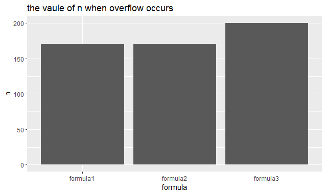
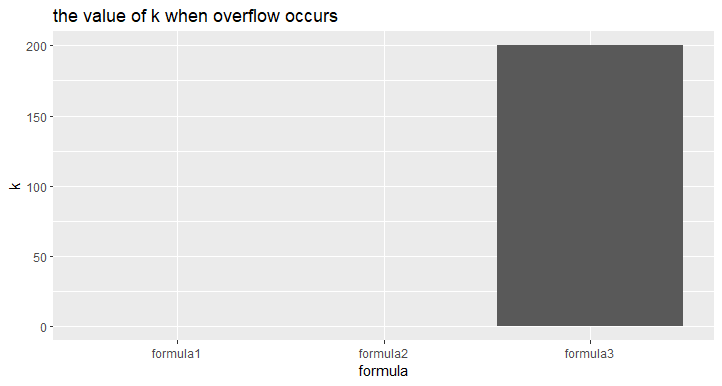

```{r setup, include=FALSE}
knitr::opts_chunk$set(echo = TRUE)
```
## Question 1: Be careful when comparing


**1.Check the results of the snippets. Comment what is going on.**

When we calculate the two functions,because the computer use floating points system to represent fractions, that leads the first one should be right, but it runs incorrectly.

**2.If there are any problems, suggest improvements.**

To improve the first function, we can use "all.equal" to make the comparison. In this way, even if there are a little differences between the two numbers, the result would be "TRUE".


## Question 2: Derivative
**1.Write your own R function to calculate the derivative of f(x) = x in this way with epsilon = 10015.**

The function is given in Appendix.


**2.Evaluate derivative function at x = 1 and x = 100000.**

We get 1.110223 when x = 1, and 0 when x = 100000


**3.What values did you obtain? What are the true values? Explain the reasons behind the discovered differences.**

We get 1.110223 when x = 1, and 0 when x = 100000
The true values should be 1 and 100000 respectively. The reason behind this phenomenon is when we add epsilon to x = 1, the significand cannot represent this right value because of the limited digits. Similarly, when we add epsilon to x = 100000, the value is not right for the same reason.


## Question 3: Variance

**1.Write your own R function, myvar, to estimate the variance in this way. 2.Generate a vector x = (x1, . . . , x10000) with 10000 random numbers with mean 108 and variance 1.**

The codes are shown in Appendix.


**3.Plot the dependence Yi on i.How well does your function work? Can you explain the behaviour?**


From the function and figure,we know that :The variance calculated with myvar function and the variance calculated with var function have different values and the variance calculated with myvar function also has some negative values.When we calculate variance using
$\sum_{i=1}^{n} x_{i}^2$minus$\frac{1}{n}$$(\sum_{i=1}^{n} x_{i})^2$,the square value is huge,and then we minus ,the difference will become greater. So in the fourth part we will use the new formula for the calculation, subtracting first and then squaring  

**4.How can you better implement a variance estimator? Find and implement a formula that will give the same results as var()?**
The code can be shown in Appendix.
The new formula is$var(\vec{x})=\frac{1}{n-1}(\sum_{i=0}^n(x_i-\overline{x})^{2})$


## Question 4: Binomial coeffcient

**1.Even if overflow and underflow would not occur these expressions will not work correctly for all values of n and k. Explain what is the problem in A, B and C respectively.**


**2.In mathematical formula one should suspect overflow to occur when parameters, here n and k, are large. Experiment numerically with the code of A, B and C, for different values of n and k to see whether overflow occurs. Graphically present the results of your experiments.**





From the two graphs we can see that:

For the first formula, when n = 171, (k = 0), the overflow will occur.
For the second formula, when n = 171, k = 0, the overflow will occur.
For the third formula, when n = 200, k = 200, the overflow will occur.

**3. Which of the three expressions have the overflow problem? Explain why.**

All of these three formulas have overflow problems. From the answer of the first question, we know that only if k = 0, the overflow problem will occur. On the condition that k != 0 and n grows up to 171, overflow will occur. As for the second formula, only when n = 171 and at the same time k = 0, overflow will happen. For the last one, when n equals k, the problem will appear, when the value of n becomes larger, this problem is less likely to occur.


## APPENDIX

Question One:
```{r}

x1<-1/3
x2<-1/4
if(x1-x2==1/12){
  print ( "Subtraction is correct " )
}else{
  print ( " Subtraction is wrong" )
}


x1<-1
x2<-1/2
if(x1-x2==1/2){
  print ( "Subtraction is correct " )
}else{
  print ( " Subtraction is wrong" )
}

```

Improvement:
```{r}
x1<-1/3
x2<-1/4
if(all.equal(x1-x2,1/12)==TRUE){
  print ( "Subtraction is correct " )
}else{
  print ( " Subtraction is wrong" )
}
```

Question Two:
```{r}
derivative<-function(x){
  epsilon<-10^-15
  deri<-(x+epsilon-x)/epsilon
  return(deri)
}


x<-1
derivative(x)
x<-100000
derivative(x)

```


#Question Three:
```{r}
myvar<-function(x){
  n<-length(x)
  variance<-1/(n-1)*(sum(x^2)-1/n*(sum(x)^2))
  return(variance)
}

set.seed(123)
x<-rnorm(10000,10^8,1)


Y<-c()
for(i in 1:10000){
  xi<-x[1:i]
  Yi<-myvar(xi)-var(xi)
  Y<-c(Y,Yi)
}
plot(1:10000,Y)


set.seed(123)
x<-rnorm(10000,10^8,1)
Y<-c()
myvar2<-function(x){
  n<-length(x)
  var_new<-sum((x-sum(x)/n)^2)/(n-1)
  return(var_new)
}
for(i in 1:10000){
  xi<-x[1:i]
  Yi<-myvar2(xi)-var(xi)
  Y<-c(Y,Yi)
}
plot(1:10000,Y,ylim = c(-4,4))
```

Question 4
```{r}
function_1 <- function(...){

  for(i in 1:200){

    if(prod(1:i) ==Inf){
      max_n_1 <- i
      return(max_n_1)
    }
  }
}

max_n_1 <- function_1()


function_2 <- function(...){
  for(i in 1:200){
    for(j in 0:i){
      if(prod((j + 1):i) == Inf || prod(1:(i - j)) == Inf){
        max_n_2 <- i
        max_k_2 <- j
        return(list(n_2 = max_n_2,k_2 =max_k_2))
      }
    }
  }
}
result <- function_2()
max_n_2 <- result[[1]]
max_k_2 <- result[[2]]

max_n_3 <- 0
max_k_3 <- 0
function_3 <- function(n){
  for(i in 1:n){
    for(j in 0:i){
        if(prod(((j + 1):i)/(1:(i - j))) == Inf){
        max_n_3 <<- i
        max_k_3 <<- j

      }
    }
  }
}
function_3(200)


n <- c(max_n_1,max_n_2,max_n_3)
k <- c(0,max_k_2,max_k_3)

data_plot1 <- data.frame(formula = c("formula1","formula2","formula3"),n)
data_plot2 <- data.frame(formula = c("formula1","formula2","formula3"),k)

library(ggplot2)

ggplot(data = data_plot1, aes(x = formula, y = n)) + geom_col() + ggtitle("the vaule of n when overflow occurs")

ggplot(data = data_plot2, aes(x = formula, y = k)) + geom_col() + ggtitle("the value of k when overflow occurs")
```
